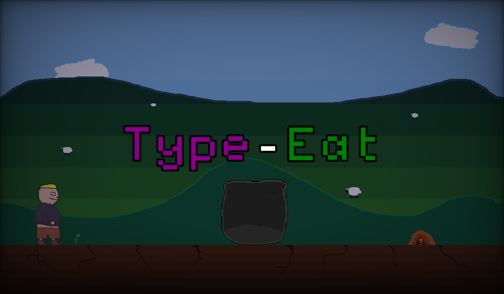
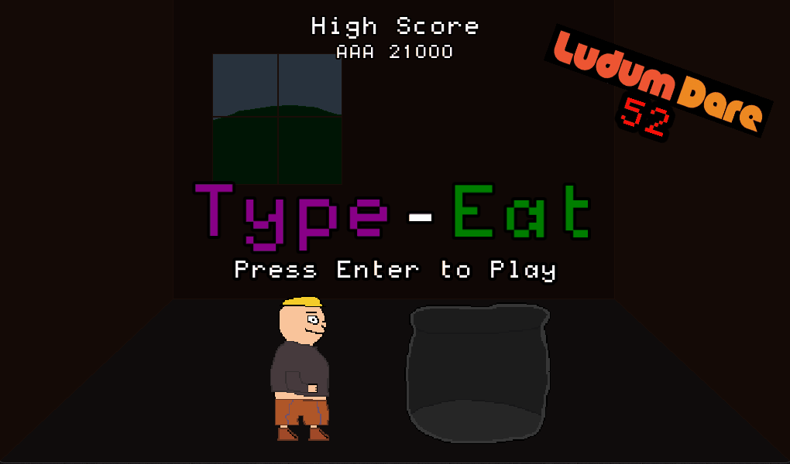

# Type-Eat - Ludum Dare 52

|             |                                                                                |
|-------------|--------------------------------------------------------------------------------|
| **Theme**   | _Harvest_                                                                      |
| **Date**    | _January 2023_                                                                 |
| **Type**    | _Compo_                                                                        |
| **Concept** | _Help a hungry dude with the help of your keyboard!_                           |

**:rocket: [Play it here!](https://srynetix.github.io/type-eat/)**

Welcome on my 6th **Ludum Dare** Compo entry!

Once again, the theme was... not what I expected, but after a couple of minutes I had a stupid idea I wanted to build.  
So there you go:

> A local dude needs your help. He really like to eat and the poor guy has nothing left in his house.  
> But lucky him, he got fields full of stuff, ready to **harvest**!  
> The only thing he's missing is something special, that you, dear player, have to help him: a KEYBOARD!  
> So help him with your typing abilities, and bring him what he wants to make him happy again!

So yes, that's a **typing game**!  
It's quite easy at first, but *can be challenging after a while*, especially when you have to type words with more than 5 letters.  
And yes, **don't miss**. Miss a letter and *you have to restart from the beginning*! How fun!

After each item fetched from the ground, the game goes **faster**.  
Every **10** items, **a new letter is added** to the word you need to type.

You wanna win and beat the highscore?  
Well, if you can reach the **first** of the **7 letter** words you should be good. :wink:

**Software used**:
- [Godot Engine 3.5.1](https://godotengine.org/) with my [sxgd](https://github.com/Srynetix/sxgd) plugin collection,
- [Pixel Studio](https://store.steampowered.com/app/1204050/Pixel_Studio__pixel_art_editor/),
- [GIMP](https://www.gimp.org/),
- [FL Studio](https://www.image-line.com/fl-studio/)

**Assets used**:
- The [FT88 font](https://gitlab.com/Eugenie-B/degheest-types/-/blob/master/fonts/ttf/FT88-Regular.ttf)
- The [Office Code Pro font](https://github.com/nathco/Office-Code-Pro)

_Good luck, and have fun!_

## Preview

